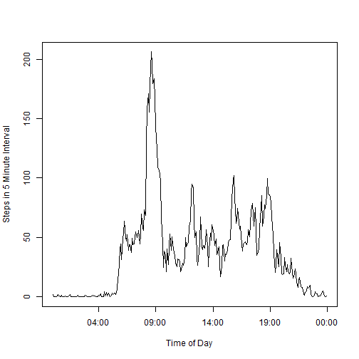

## R Environment setup
We'll be using the dplyr and lattice packages for this report.

```r
library(dplyr)
library(lattice)
```

## Loading and preprocessing the data

```r
# read the table
activity <- read.csv(unz("activity.zip","activity.csv"))
head(activity)
```

```
##   steps       date interval
## 1    NA 2012-10-01        0
## 2    NA 2012-10-01        5
## 3    NA 2012-10-01       10
## 4    NA 2012-10-01       15
## 5    NA 2012-10-01       20
## 6    NA 2012-10-01       25
```


## What is mean total number of steps taken per day?
Here we display the distribution of total number of steps per day, as well as the mean and median number of steps per day.

```r
# part 1 - What is mean total number of steps taken per day?
#    histogram and mean/median of steps per day
by_day <- group_by(activity,date)
steps_by_day <- summarize(by_day,total_steps=sum(steps,na.rm=TRUE))

hist(steps_by_day$total_steps,breaks=10,
     main="Steps per Day",
     xlab="Steps per Day",
     ylab="Frequency (days)",
     col="red")
```

 

```r
print(summary(steps_by_day$total_steps)[4:3])
```

```
##   Mean Median 
##   9354  10400
```
The median number of steps per day is (9,354 steps) and the mean number of steps per day is (10,400 steps).

## What is the average daily activity pattern?

```r
# part 2 - What is Average Daily Activity Pattern?
by_time <- group_by(activity,interval)
steps_by_interval <- summarize(by_time,
                               avg_steps=mean(steps,na.rm=TRUE),
                               med_steps=median(steps,na.rm=TRUE))

# convert interval to a time format for proper timeseries plot
steps_by_interval$time <- strptime(sprintf("%04d",steps_by_interval$interval),"%H%M")

plot(steps_by_interval$time,
     steps_by_interval$avg_steps,
     type="l",
     xlab="Time of Day",
     ylab="Steps in 5 Minute Interval")
```

 

```r
# which interval has the highest average?
highest <- which(max(steps_by_interval$avg_steps)==steps_by_interval$avg_steps)
print(format(steps_by_interval[highest,"time"],"%H:%M"))
```

```
##    time
## 1 08:35
```

```r
print(steps_by_interval[highest,2])
```

```
## Source: local data frame [1 x 1]
## 
##   avg_steps
##       (dbl)
## 1  206.1698
```
The highest average number of steps in an interval occurs at (08:35) with an average of about (206 steps) in that 5 minute interval.  At 8:35am we can imagine that the subject is walking to work, or walking from their car to their office at the beginning of the work day.

## Imputing missing values

```r
# part 3 - impute missing values - impute missing values as mean value of interval
missing_steps <- sum(is.na(activity$steps))

# print the number of records with missing values
print(missing_steps)
```

```
## [1] 2304
```
Out of 17,568 records in the dataset, 2,304 have missing values.  Here we will use the average number of steps in an interval to impute (or fill in) missing values for intervals with missing number of steps.


```r
activity_imputed <- merge(activity,steps_by_interval[,c("interval","avg_steps")])
activity_imputed$steps <- ifelse(is.na(activity_imputed$steps),
                             activity_imputed$avg_steps,
                             activity_imputed$steps)
activity_imputed<-arrange(activity_imputed,date,interval)
activity_imputed$avg_steps <- NULL

by_day2 <- group_by(activity_imputed,date)
steps_by_day2 <- summarize(by_day2,total_steps=sum(steps,na.rm=TRUE))

hist(steps_by_day2$total_steps,breaks=10,
     main="Steps per Day (imputed values)",
     xlab="Steps per Day",
     ylab="Frequency (days)",
     col="red")
```

 

```r
print(summary(steps_by_day2$total_steps)[4:3])
```

```
##   Mean Median 
##  10770  10770
```


## Are there differences in activity patterns between weekdays and weekends?

```r
# part 4 - Are there differences in activity patterns between weekdays and weekends?
activity_imputed$datetime <- strptime(paste(activity_imputed$date,
                                            sprintf("%04d",activity_imputed$interval))
                                      ,"%Y-%m-%d %H%M")
activity_imputed$weekday <- 
    ifelse(weekdays(activity_imputed$datetime) %in% c("Saturday","Sunday"),
                                   "Weekend",
                                   "Weekday")
activity_imputed$datetime <- NULL

by_time3 <- group_by(activity_imputed,weekday,interval)
steps_by_interval3 <- summarize(by_time3,
                               avg_steps=mean(steps,na.rm=TRUE))

xyplot(avg_steps~interval | factor(weekday),
       data=steps_by_interval3,type="l",
       layout=c(1,2),
       ylab="Number of Steps",
       xlab="Interval")
```

 

It appears, from the above plots, that there is a difference between weekdays and weekends.  Mainly, there is noticable peak of activity around 08:30 on weekdays.  On weekends the pattern of activity is more uniform.
